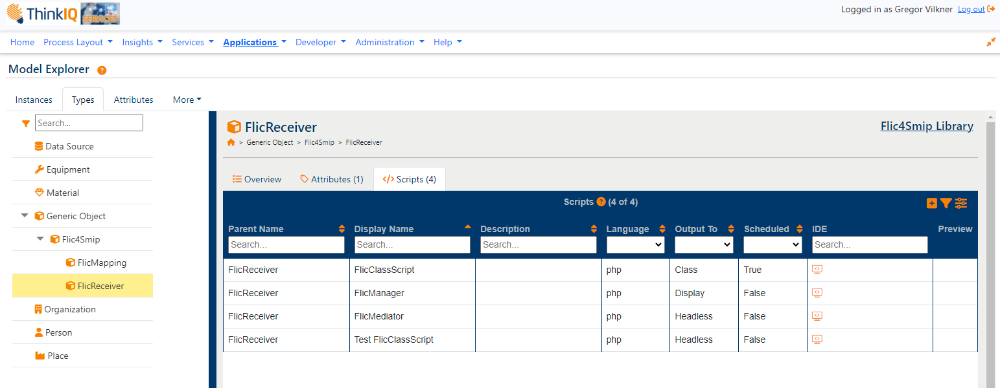
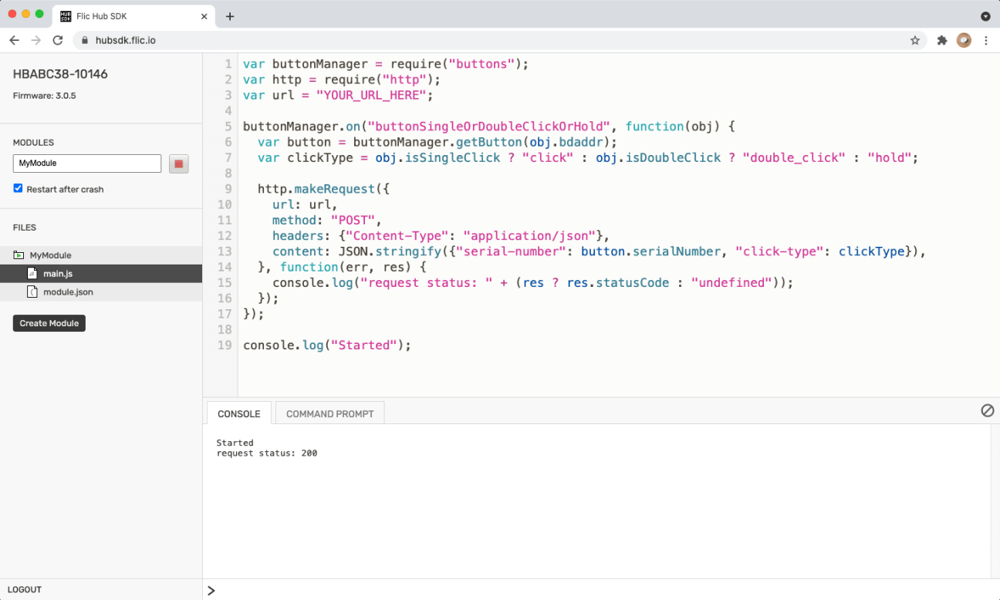
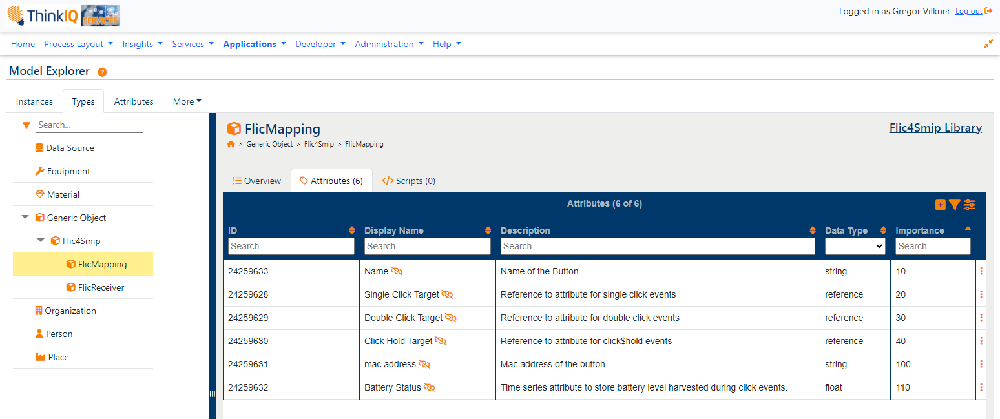
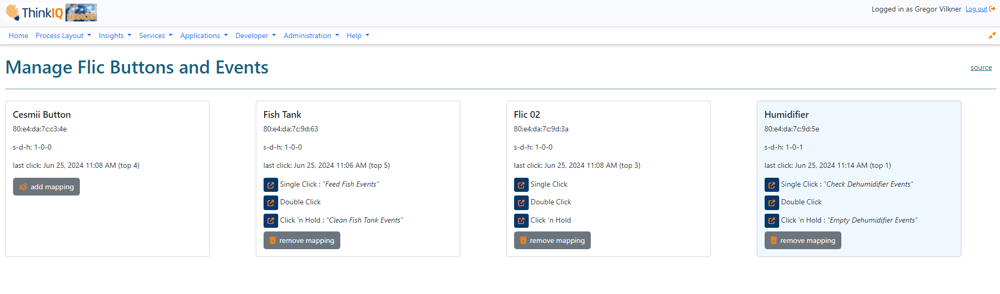

### 1 Smart Buttons for Smart Manufacturing
Flic is a range of IoT products made by the Swedish company [Shortcut Labs AB](https://flic.io/). The product line includes various hub devices and wireless buttons. Although the product is primarily targeting end users and smart home integrations, we believe that low-cost wireless devices such as Flic smart buttons can positively impact brown-field manufacturing. Activities such as counting, indicating of status, signing in and out of workstations, starting, pausing, stopping of production runs can easily be digitized by implementing easy-to-use IoT buttons.

_Image 1: Countless industrial and manufacturing use cases exist besides smart homes._
### 2 Modes of Operation for Smart Buttons
First use cases are limited to simply write a value at a time of a button press to a target attribute. Once we obtain an attribute's current value, however, a number of interesting use cases become possible:

a) Simply write "1"
	This would support apps such as an inspection walk. Simply place an appropriate number of buttons at points of interest, and when an inspector passes by the buttons are pressed to log time and sequence.
b) Switch a Boolean On/Off
	Switching on/off simply toggles a Boolean attribute. We can use this to control networked devices or to indicate simple alerts or states.
c) Increase or Decrease Count
	 You can think of the following setup: Single click to count up, double click to count down, _click&hold_ to reset to zero. An interesting use of smart buttons is simply to harvest timestamps. Combined with counts, this could make production time studies more efficient as it would reduce the need of manual note taking. That supervisor with a hand in their pockets: probably harvesting timestamps or busy counting.
d) Toggle Enumeration Forwards/Backwards
	If we target enumeration attributes we can use the list of enumeration values to iterate forward (single click) or backwards (double click). Finally, _click&hold_ would be used to submit a new status. 

While the first use case would use "none" as interpolation method, the later three use cases would utilize "previous" as interpolation method.

Finally, an exciting product that is not yet supported in the sdk is the Twist Button: it is a button with a turn dial around it. One would use _click&hold&dial_ to change an enumeration value and any of the simple click operations to submit a new state value. Either 4 or 12 dial values are supported. Flick buttons ship with a broad range of example stickers, and one could easily imagine appropriate manufacturing iconography to stick on the buttons.
### 3 Getting Technical: From Unpacking to Ready for Use
#### 3.1 Getting Connected and Establishing Communication with the SMIP
Control hubs and buttons are super easy to setup and manage using an app on a phone. The Flic team provides a range of api's and sdk's to support custom use cases. We used the web-based hub SDK to create a simple JavaScript module that runs on the hub and subscribes to button click events. First we created a FlicManager type on the SMIP and placed a single instance in our model tree. At this point the FlicManager is a simple type with a single json time series attribute to store messages. We used the SMIP's GraphQL API to:
- obtain a JWT using an authenticator, 
- obtain a target attribute id on the FlicManager instance, and
- send the click event as a json payload to the target attribute.

_Image 2: Flic Receiver Type in the SMIP_

A few comments on this first step:
1) This first iteration was very smooth and straight forward.
2) The json payload includes metadata about the event (single/double/_click&hold_) and about the button (mac, name, battery status, button timestamp). We used the hub's clock as the timestamp provider. We will have to review how the hub maintains time.
3) The hub sdk is accessed over the web but connects to hubs that are connected on the same wireless network. Modules are edited in a slick browser-based IDE but stored and executed on the hub device. The JavaScript runtime available to execute modules is based on a dated version of [Duktape](https://duktape.org/). For now, this means that coding smart buttons is a bit limited in scope: the lack of await and fetch was especially challenging. A future update from the Flic team promises a different JS runtime [QuickJS](https://bellard.org/quickjs/). We can't wait...

_Image 3: Add JavaScript Modules using the Flic Hub sdk_
#### 3.2 Refactor to Store JWT
Our first iteration was a quick nesting of http requests: a little Pyramid of Doom. It worked, and it had to be cleaned up a bit. Since a module runs on the hub continuously as a service, we pursued two goals with this refactor:
1) We should keep the JWT and only renew if needed. We duktape-de-serialized the JWT to get its expiration time. Less calls per button press is a good thing.
2) We should ask for the target attribute id only once, and then store it. At this time we were not bothering with "what if the target attribute moves".
3) We learned that the "restart after crash" flag also means "restart after re-boot". You want your modules to automatically run after a power-cycling event.

#### 3.3 Mediator on the SMIP to Manage Buttons and Push to Attributes
At this point our hub continuously executes a stable runtime of our module in a steady fashion: no matter if you are clicking buttons in the morning after several hours of idleness or if we test random power cycling of the hub - events simply show up in the SMIP. This is a great milestone, because it means that we store and reliably rotate JWT's and that we always have a valid target attribute id. Time to leave the hub alone for a bit, move over to the SMIP, and figure out what to do with the events...

We put three things in place to distribute events in the SMIP:
1) We created a type for a FlicMapping, whose instances are a digital companion for each individual button. They are uniquely linked by mac address, and map which attributes are to be serviced on click events (single, double, and _click&hold_). The FlicMapping instances also store the battery level in a dedicated time series attribute as we harvest this information within the meta-data on each click event.
2) We associated a display script with the FlicManager type that shows existing FlicMappings and recently observed buttons that have not been mapped. Mappings can interactively be added, modified, and removed. New FlicMappings are stored underneath the FlicManager instance.
3) Finally, we use a headless script to periodically check for new messages and distribute them according to the FlicMappings.

_Image 4: Flic Mapping Type in the SMIP_

In addition to receiving messages reliably on the FlicManager's messages attribute, we now also distribute messages across our model according to mappings managed by a display script. The only drawback is that "periodically" means "once per minute polling". Let's think if we can get the click events where they should go more efficiently.
#### 3.4 Push Events directly to Attributes
One thing we put into the Flic JS module right after obtaining a JWT and before posting a click-event message is to lookup the "target attribute id". What if we could retrieve not only the target attribute id for all messages, but also a FlicMapping, if available for a single/double/_click&hold_ event for a particular button? Turns out we can do just that using a single query using the SMIP GraphQL API. So, in addition to pushing all click-events into the FlicManager's messages attribute, we also push messages directly into a mapped target attribute, if such a mapping exists. This has been in place for a while now and works really well. It also effectively renders the mediator mute and unnecessary.

_Image 5: Flic Manager Display Script in the SMIP 
a) The Cesmii Button has not been mapped in the SMIP yet
b) The Fish Tank button has been mapped and attributes have been assigned for click events
c) Flic 02 button has been mapped, but no attributes have been assigned for click events
d) The Humidifier button has been configured similar to the Fish Tank button_
