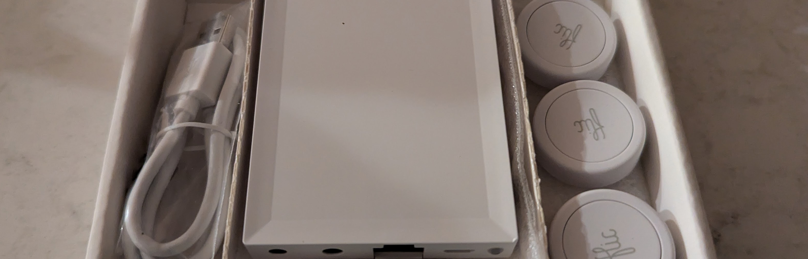
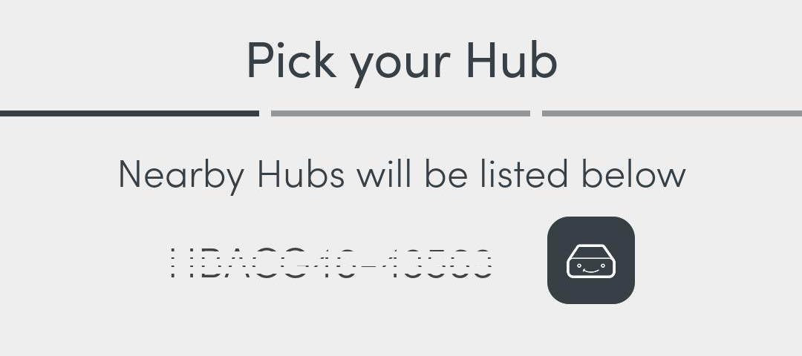
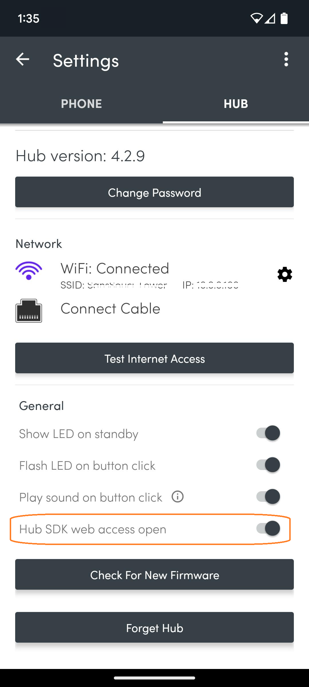
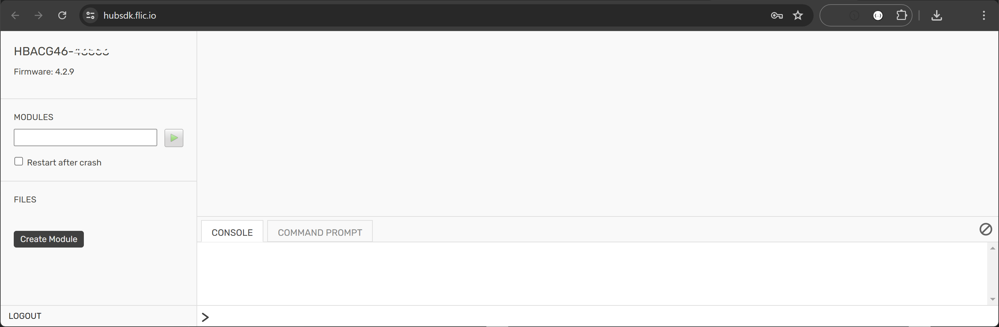
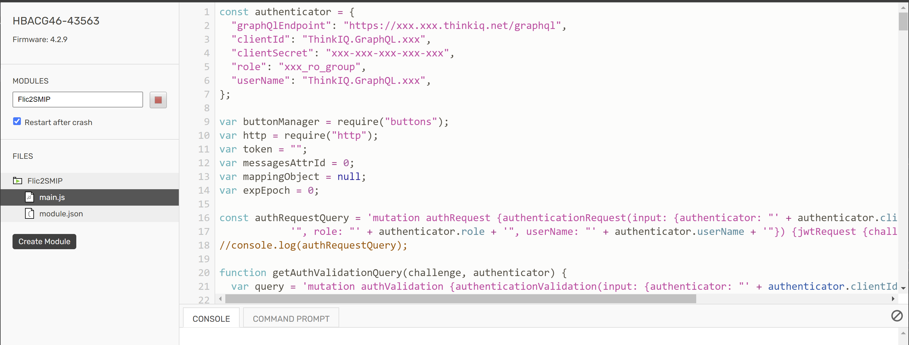
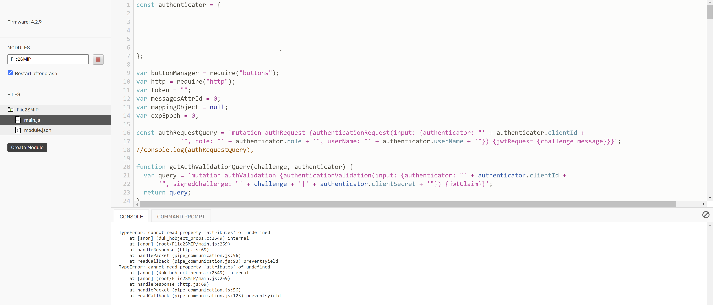
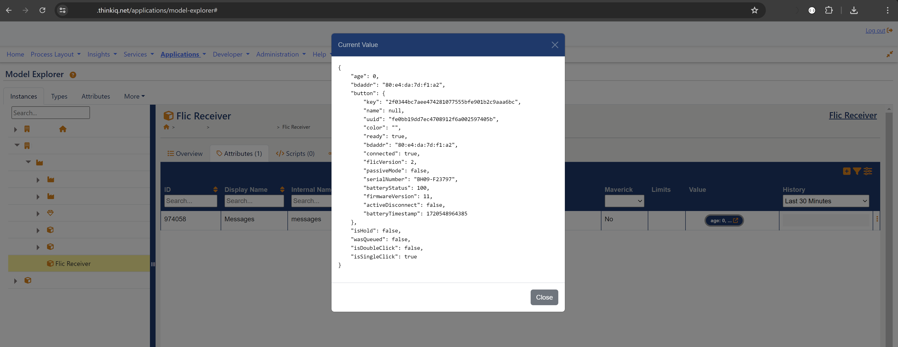
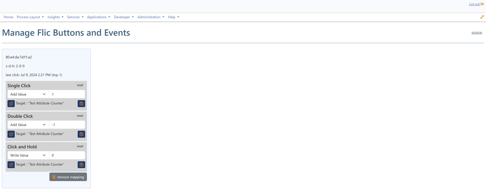
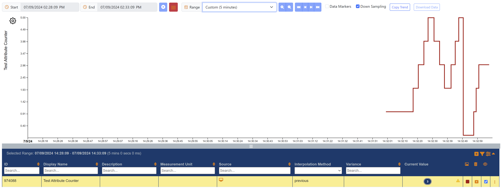

# Flic-Integration with the SMIP

This project enables the use of Flic Smart Buttons by the Swedish company [Shortcut Labs AB](https://flic.io/) with the [ThinkIQ](https://www.thinkiq.com) Industry 4.0 Manufacturing Platform. The platform is also know as the [Smart Manufacturing Innovation Platform](https://www.cesmii.org/smip) (SMIP).

## What's in this Repo

This repository contains:
1) A SMIP library including a browser script that allows to configure smart buttons and map events to attributes in the model.
2) A JavaScript module for a Flic hub. The module utilizes the SMIP's GraphQL API for authorization and posting of Flic Smart Button click events.
3) A [blog post](Integrating Flic Smart Buttons with the SMIP.md) about motivation and usage of this project.

## Step by Step: Setting up a new Flic Hub



### Step 1: Start & Discover Hub

- Let get that Hub LR out of the box and plugged in.
- Open the Flic app on your phone and discover the hub. 

### Step 2: Connect the Hub to Wi-Fi and Enable the Hub SDK

- Connect the hub to a Wi-Fi network, because cat5 is so 1995...

At this point you can either move on and add buttons to the hub, or head to Settings to validate that you have a) network, b) an IP address, and c) internet access. You can also (re)name the hub and change its password. The factory password is printed on the back of the hub, very similar to what we're used to from Wi-Fi routers.

- very important: enable the Hub SDK web access in the hub's Settings

### Step 3: Copy the Flic2SMIP JavaScript Module

- Access the Flic [Hub SDK](https://hubsdk.flic.io/) 
- We never got the auto-detect to work. Use the hub's IP address and the factory password.  This is very cool. Modules go on the left. Console and CLI is right-bottom. Code goes into right-top.
- Create a new module (Flic2SMIP works as a name) and copy the JavaScript [module code](./src/flic/main.js) from this repo. 
- Check the "Restart after crash" option. This ensures that the hub automatically starts our module not only after crashes but more importantly after power recycling events.
- Toggle between Start and Run - there should be no compile errors in the console

### Step 4: Import Library and Create Authenticator on the SMIP

- On your SMIP instance, import the [Flic4Smip library](./src/SMIP/Flic4Smip Library/Flic4Smip Library.json) from this repo.
- Create an Authenticator (Flic4SMIP Authenticator works as a name) so that the Flic hub can access the GraphQL API of the SMIP. A read-only role is sufficient, unless you want to use enumeration states, which requires a read/write token to change a target attribute's static enumeration value.
### Step 5: Copy Authenticator Meta Data into Hub Module

- Copy your Authenticator information into the top 7 lines of your hub module.
``` javascript
const authenticator = {
	"graphQlEndpoint": "https://smip_instance_name.thinkiq.net/graphql",
	"clientId": "Flic4SMIP Authenticator",
	"clientSecret": "__xyz__-_12_-_34_-_56_-_____xyz____",
	"role": "smip_instance_name_group",
	"userName": "Flic4SMIP Authenticator",
};
```

### Step 6: Register a Button and Check Data Flow into SMIP

- We are now ready to see if this all works. Let's map a button in the Hub phone app. Once this is finished, the Flic2SMIP module should be intercepting click events. Since we haven't created a Flic Receiver (next step) in the SMIP yet, the code throws an error like so: 
- Create an instance of the Flic Receiver type anywhere in your SMIP model
- Click some more and validate that data is flowing into the SMIP by checking the raw data of the Flic Receiver's messages attribute. 

### Step 7: Map Button Click Events and Actions to Attributes 

- The button we tested should now show up on the Flic Manager Display app.
- Let's add a test attribute for a counter (use int as data type and dynamic/internal as data source)
- Configure the button like shown below: 
- We should now be able to single click to increase, double click to decrease and _click&hold_ to reset the counter. 