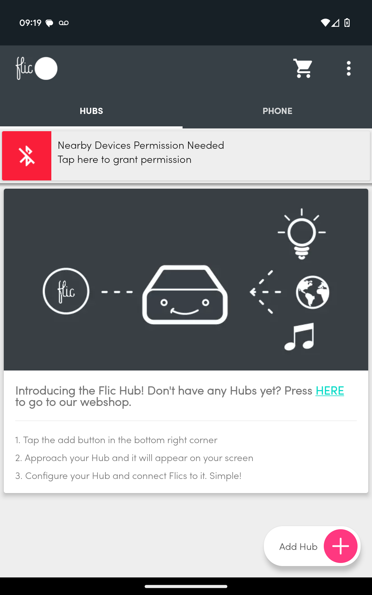
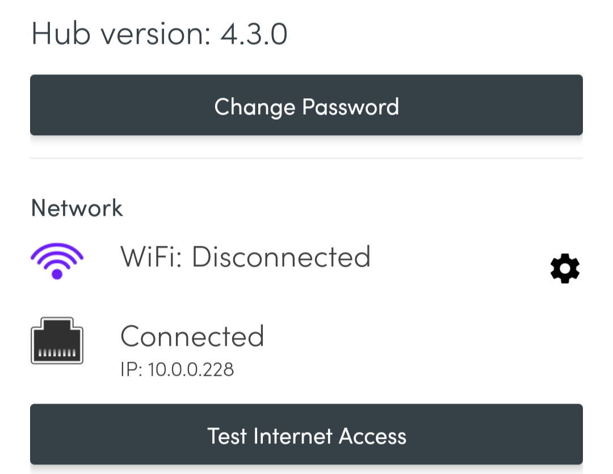

# Flic-Integration with the SMIP

This project enables the use of Flic Smart Buttons by the Swedish company [Shortcut Labs AB](https://flic.io/) with the [ThinkIQ](https://www.thinkiq.com) Industry 4.0 Manufacturing Platform. The platform is also know as the [Smart Manufacturing Innovation Platform](https://www.cesmii.org/smip) (SMIP).

## What's in this Repo

This repository contains:
1) A SMIP library including a browser script that allows configuring smart buttons and mapping events to attributes in the model.
2) A JavaScript module for a Flic Hub. The module utilizes the SMIP's GraphQL API for authorization and posting of Flic Smart Button click events.
3) A [blog post](Integrating Flic Smart Buttons with the SMIP.md) about motivation and usage of this project.

## Step by Step: Setting up a new Flic Hub


### Step 1: Start & Discover Hub

- Get that Hub LR out of the box and power it up using USB power.
- If you haven't, download the Flic app on your phone and create an account.
- Open the Flic app on your phone and discover the Hub.
- You'll be able to simply add the Hub if it's fresh and noob. Once a Hub has been worked with, you'll need to provide a password to add it to your collection of Flic hubs.


### Step 2: Connect the Hub to Wi-Fi and Enable the Hub SDK

- Connect the Hub to a Wi-Fi network, because cat5 is so 1995...

At this point you can either move on and add buttons to the Hub, or head to Settings to validate that you have a) network, b) an IP address, and c) internet access. You can also (re)name the Hub and change its password. The factory password is printed on the back of the Hub, very similar to what we're used to from Wi-Fi routers.

- very important: enable the Hub SDK web access in the Hub's Settings
 


### Step 3: Copy the Flic2SMIP JavaScript Module

- Access the Flic [Hub SDK](https://hubsdk.flic.io/) 
- We never got the auto-detect to work. Instead, use the Hub's IP address and the factory password to connect to the IDE.

 This is very cool. Modules go on the left. Console and CLI is right-bottom. Code goes into right-top.
 
- Create a new module (Flic2SMIP works as a name) and copy the JavaScript [module code](./src/flic/main.js) from this repo.
 


- Check the "Restart after crash" option. This ensures that the Hub automatically starts our module not only after crashes but more importantly after power recycling events.
- There is a Play/Stop Button button: use that to run a module and to stop it. There should be no compile errors in the console
- One can edit a script at any time, even if the module is running. We miss a save button in the IDE and the only way to make sure your code changes stick appears to be to stop and re-start the module.

### Step 4: Import Library and Create Authenticator on the SMIP

- On your SMIP instance, import the [Flic4Smip library](./src/SMIP/Flic4Smip Library/Flic4Smip Library.json) from this repo.
- Create an Authenticator (Flic4SMIP Authenticator works as a name) so that the Flic Hub can access the GraphQL API of the SMIP. A read-only role is sufficient, unless you want to use enumeration states, which requires a read/write token to change a target attribute's static enumeration value.
### Step 5: Copy Authenticator Meta Data into Hub Module

- Copy your Authenticator information into the top 7 lines of your Hub module.

``` javascript
const authenticator = {
	"graphQlEndpoint": "https://smip_instance_name.thinkiq.net/graphql",
	"clientId": "Flic4SMIP Authenticator",
	"clientSecret": "__xyz__-_12_-_34_-_56_-_____xyz____",
	"role": "smip_instance_name_group",
	"userName": "Flic4SMIP Authenticator",
};
```

### Step 6: Register a Button and Check Data Flow into SMIP

- We are now ready to see if this all works. Let's map a button in the Hub phone app. Once this is finished, the Flic2SMIP module should be intercepting click events. Since we haven't created a Flic Receiver (next step) in the SMIP yet, the code throws an error like so:
 


- Create an instance of the Flic Receiver type anywhere in your SMIP model
- Click some more and validate that data is flowing into the SMIP by checking the raw data of the Flic Receiver's messages attribute.
 


### Step 7: Map Button Click Events and Actions to Attributes 

- The button we tested should now show up on the Flic Manager Display app.
- Let's add a test attribute for a counter (use int as data type and dynamic/internal as data source)
- Configure the button like shown below:
 


- We should now be able to single click to increase, double click to decrease and _click&hold_ to reset the counter.
 


## Step by Step: Receiving a Pre-Configured Flic Kit

### Step 1: Install the Flic App on a Phone

Yes, to be able to get a configured Flic Hub with pre-installed and mapped buttons, you'll need to install the Flic app on a smart phone:

- Create an account using an email and a password.
- You can opt out of newsletters, even though they're lovely and from Sweden.
- You can opt out of notifications.
- You _can not_ opt out of your device being able to detect nearby devices. With smart buttons and all, that's the whole point.


### Step 2: Detect and Add the Flic Hub

- Power up the Flic Hub.
- Use the phone app to detect and add the Hub.
- You'll have to provide the factory password from the back of the Hub as a password.
- For the Hub to be able to communicate with the SMIP, you'll need to configure internet access either using WiFi or an Ethernet connection.
### Step 3: Configure more Buttons. Improve your Workflows.

Congratulations. Your Hub knows the Flic Buttons that were previously paired (and probably shipped with the Hub). The JavaScript module should be running and sending Flic Button click events to the SMIP as configured there. However, ...

... you can remove buttons and add buttons at will. You can see new button click events in the SMIP and configure them to do a variety of actions and target any attribute in your model. 

Go click!!!

## Appendix: WiFi vs. Ethernet and How to Secure your Flic Hub

This is just a brief summary of observations from users of the Flic products. We don't make the Flic products.

- Communication between a Hub and a the Flic phone app does not require the 2 devices to be on the same network. The phone app can communicate with a Hub just by being in it's vicinity.
_But how???_ We'll need to find out. Flic documentation is pretty good. We're sure it's in there.

 - Connecting to the Flic Hub's IDE _does_ require your laptop and the Hub to be on the same network. So once you put the Hub on Cat5 only, you'll need to be on that network also.
 _Note:_ Use the phone app to get the Hub's IP address.

- You can always connect the Hub to a Cat5 cable.
_Note:_ You can use the phone app for the Hub to _forget_ previously used WiFi networks and thus solely rely on the Cat5 connection.



- If a Hub is down for a while and the Flic2SMIP JavaScript module doesn't startup automatically, you'll have to help by connecting to the Flic Hub SDK / IDE and manually starting the module.